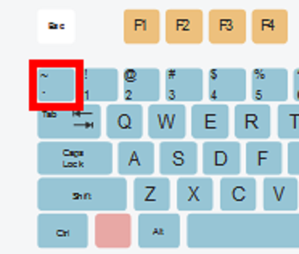

# Writing Good Documentation
This document is for the Terraform Bootcamp. 

## Step 1 - Using Codeblocks.

Codeblocks in markdown make it *very easy* for tech people to **copy, paste, share** code.
A good __Cloud Engineer__ uses Codeblocks whenever possible. 

Because it allows others to copy and paste their code to replicate or research issues. 

- In order to create codeblocks in markdown you need to use three backticks (`)
- Not to be confused with single quotations (')
  
```def factorial(n)
  if n == 0
    return 1
  else
    return n * factorial(n - 1)
  end
end

puts "Enter a number to calculate its factorial:"
num = gets.chomp.to_i

if num < 0
  puts "Factorial is not defined for negative numbers."
else
  result = factorial(num)
  puts "The factorial of #{num} is #{result}."
end
```

- When you can you should attempt to apply syntac highlighting to your codeblocks.

```ruby
def factorial(n)
  if n == 0
    return 1
  else
    return n * factorial(n - 1)
  end
end

puts "Enter a number to calculate its factorial:"
num = gets.chomp.to_i

if num < 0
  puts "Factorial is not defined for negative numbers."
else
  result = factorial(num)
  puts "The factorial of #{num} is #{result}."
end
```

- Make not of where the backtick key is located.
- It should appear above the tab key,
- but it may vary based on your keyboard layout.



Good Cloud Engineers use codeblocks for both Code and Errors that appear in the console.

```bash
Traceback (most recent call last):
  example.rb:2:in `<main>': undefined local variable or method `undefined_variable' for main:Object (NameError)
Did you mean?  defined?
```
> Here is an example of using a codeblock for an error that appers in bash.

When you can always provide a codeblock instead of a screenshot.
If you need to take a screenshot make sure its not a photo from your phone. 

> There are certain cases where its okay to take photos with your phone. This is when you are showing something like a keyboard, which does not appear on a computer screen. If it is rendered on your computer screen it should be a screenshot.

## Step 2 - how to take screenshots

A screenshot is when you capture a part of your creen from your laptop, desktop or phone.

This is not to be confused with taking a photo with your phone.

**DON'T DO THIS**


This is what a screenshot from your computer should look like.

""DO THIS INSTEAD**


To take screenshots on both Mac and Windows, you can use built-in hotkeys or keyboard shortcuts. Here are the common hotkeys for taking screenshots on both platforms:

**Mac:**

1. **Capture the entire screen:**
   - Press `Command (⌘) + Shift + 3`.

2. **Capture a selected portion of the screen:**
   - Press `Command (⌘) + Shift + 4`, and then click and drag to select the area you want to capture.

3. **Capture a specific window:**
   - Press `Command (⌘) + Shift + 4`, then press the `Spacebar`, and click on the window you want to capture.

4. **Capture the Touch Bar (on MacBook Pro with Touch Bar):**
   - Press `Command (⌘) + Shift + 6`.

5. **Take a screenshot and save it to the clipboard (without saving as a file):**
   - Add `Control` to any of the above shortcuts. For example, `Command (⌘) + Control + Shift + 3` captures the screen to the clipboard.

**Windows:**

1. **Capture the entire screen:**
   - Press `PrtScn` (Print Screen) key. On some keyboards, you may need to press `Fn` or `Function` along with `PrtScn`.

2. **Capture the active window:**
   - Press `Alt + PrtScn`. This captures only the currently active window and copies it to the clipboard.

3. **Capture a selected portion of the screen (Windows 10 and later):**
   - Press `Win + Shift + S` to open the Snipping Tool, or `Win + Shift + S` to open Snip & Sketch. Then, select the area you want to capture.

4. **Capture the entire screen and save as a file (Windows 10 and later):**
   - Press `Win + Shift + S`, select the area you want to capture, and it will be copied to the clipboard. You can then paste it into an image editor or document.

5. **Capture a specific window (Windows 10 and later):**
   - Press `Alt + PrtScn`, and it will capture only the currently active window and copy it to the clipboard.

6. **Capture the entire screen and save it as a file (Windows 10 and later):**
   - Press `Win + Shift + S`, select the area you want to capture, and it will be copied to the clipboard. You can then paste it into an image editor or document.

7. **Use the Snipping Tool (Windows 7 and later):**
   - Search for "Snipping Tool" in the Start menu. This tool allows you to capture specific portions of the screen and save them as image files.

Please note that the exact hotkeys and options may vary slightly depending on your specific version of macOS or Windows.

## Step 3 - Use Github Flavored Task Lists

Github extends Markdown to have a list where you can check off items.[^1]

- [x] Finish Step 1
- [ ] Finsih Step 2
- [x] Finish Step 3

# Step 4 - Use Emoji's

Github Flavored Markdown(GFM) supports emoji shortcodes.

| Name | Shortcode | Emoji |
| --- | --- | --- |
| Cloud | `:cloud:` | :cloud: |
| Cloud With Lightning | `cloud_with_lightning` | 🌩️ |
| Space Invader | `:space_invader:` | :space_invader: |

# Step 5 - how to create a table

You can use the following markdown format to create tables:
```md
| Name | Shortcode | Emoji |
| --- | --- | --- |
| Cloud | `:cloud:` | :cloud: |
| Cloud With Lightning | `cloud_with_lightning` | 🌩️ |
| Space Invader | `:space_invader:` | :space_invader: |
```
Github extends the functionality of Markdown tables to provide more alignment and table cell formatting options.[^2]

- Make not of where the pipe key is located.
- It should appear above the enter key,
- but it may vary based on your keyboard layout.


## External References

- [Basic writing and formatting syntax](https://docs.github.com/en/get-started/writing-on-github/getting-started-with-writing-and-formatting-on-github/basic-writing-and-formatting-syntax)
- [Markdown Cheat Sheet](https://www.markdownguide.org/cheat-sheet/)
- [GFM - Task Lists](https://docs.github.com/en/get-started/writing-on-github/getting-started-with-writing-and-formatting-on-github/basic-writing-and-formatting-syntax#task-lists) [^1]
- [GFM - Emoji Cheatsheet](https://github.com/ikatyang/emoji-cheat-sheet)
- [GFM - Tables (with extensions)](https://github.github.com/gfm/#tables-extension-)[^2]
